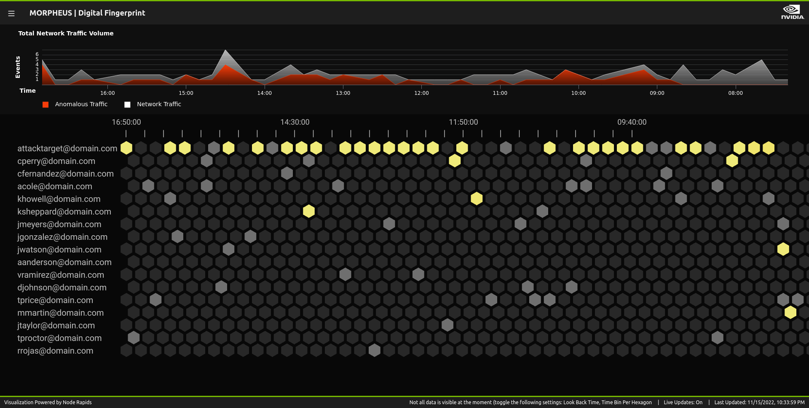

# Morpheus Digital Finger Print Visualization Tool

Visualize user access events and detect anomalies based on the anomaly score, while also tracking down anomalous patterns amongst all users.



## Getting Started

This dashboard is meant to be run after running the Morpheus Digital Fingerprinting(DFP) pipeline on Azure and Duo log data to generate input files for visualizing.

You can find more information in the [DFP Production Pipeline Example Readme](https://github.com/nv-morpheus/Morpheus/tree/branch-22.11/examples/digital_fingerprinting/visualization).

## Installation

### CUDA/GPU requirements

- CUDA 11.0+
- NVIDIA driver 450.80.02+
- Pascal architecture or better (Compute Capability >=6.0)

### 1. Install the dependencies

```bash
yarn && yarn build
```

### 2. Set the data directory

Set the `dataset_path` environment variable to set the data directory where the input data DFP visualization application will be periodically saved.

If `dataset_path` is not set, the default data directory will be [./public/data](./public/data).

### 3. Running the app

```bash
yarn start
```

Go to [http://localhost:3000](http://localhost:3000)

## Application Screenshots

> Configuration Panel
> 

> Event onClick info panel
> 

## Development

To start a development server, execute the following commands:

```bash
yarn dev
```

##

## Deployment

The easiest way to deploy your Next.js app is to use the [Vercel Platform](https://vercel.com/new?utm_medium=default-template&filter=next.js&utm_source=create-next-app&utm_campaign=create-next-app-readme) from the creators of Next.js.

Check out our [Next.js deployment documentation](https://nextjs.org/docs/deployment) for more details.
