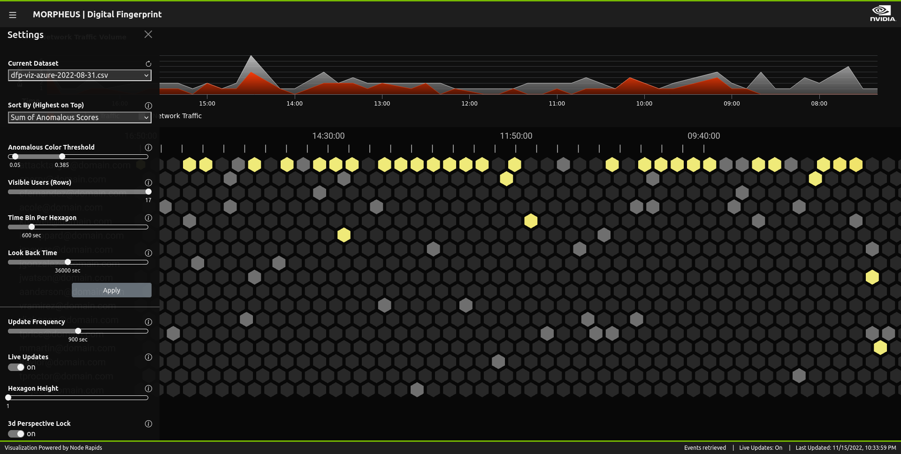

# Morpheus Digital Finger Print Visualization Tool

Visualize user access events and detect anomalies based on the anomaly score, while also tracking down anomalous patterns amongst all users.


## Getting Started

This dashboard is meant to be run after running the Morpheus Digital Fingerprinting(DFP) pipeline on Azure and Duo log data to generate input files for visualizing.

You can find more information in the [DFP Production Pipeline Example Readme](https://github.com/nv-morpheus/Morpheus/tree/branch-22.11/examples/digital_fingerprinting/visualization).

The application backend compute is powered by the NODE RAPIDS (specifically @rapidsai/cudf) packages. More information about node-rapids can be found [here](https://github.com/rapidsai/node).

## Requirements

### CUDA/GPU requirements

- CUDA 11.0+
- NVIDIA driver 450.80.02+
- Pascal architecture or better (Compute Capability >=6.0)

### OS requirements

- Server: See the [Rapids System Requirements section](https://rapids.ai/start.html#requirements) for information on compatible OS.
- Client: Chrome(tested on v107) / firefox(tested on v106) / safari (tested on v15)

### RAPIDS

- @rapidsai/cudf ([dev](https://github.com/rapidsai/node/tree/main/modules/cudf), [npm](https://www.npmjs.com/package/@rapidsai/cudf))

## Installation

### 1. Install the dependencies

```bash
yarn && yarn build
```

### 2. Set the data directory

Set the `dataset_path` environment variable to set the data directory where the input data DFP visualization application will be periodically saved.

If `dataset_path` is not set, the default data directory will be [./public/data](./public/data).

### 3. Running the app

```bash
yarn start
```

Go to [http://localhost:3000](http://localhost:3000)

## Configuration file (`.env`)

This file controls configuration options for the application on startup. The configuration options starting with the `NEXT_PUBLIC_` prefix can also be controlled once the app has started, via the settings panel on the left of the dashboard, this merely provides a way to preset them to be set as defaults on startup.

This file also contains default values for individual event attributes for both azure and duo, which if present in this file, will be used to scale the attribute values for each event. If a value for a particular attribute is not found in the `.env` file, the `min` and `max` values of the current dataset in memory will be used to scale the individual event selected.

## Troubleshooting and FAQ

1. `Error: libnvrtc.so.11.\*: cannot open shared object file: No such file or directory`.

This could be a result of incorrect or missing cudatoolkit in your environment, especially if running outside a RAPIDS docker container. Make sure the install the [latest cudatoolkit](https://developer.nvidia.com/cuda-downloads).

2. `Out of Memory` error.

This could happen if the dataset being loaded is larger the GPU memory available. One way to avoid this would be to break down the azure and duo logs into smaller files, covering a smaller amount of time, pause `live updates` and go through each file individually by selecting it from the `Current Dataset` dropdown in the left settings panel.

3. `yarn: command not found` error

Make sure to install the [latest `yarn` package](https://classic.yarnpkg.com/lang/en/docs/install/#debian-stable) in your environment.

## Screenshots

> Configuration Panel
> 

> Event onClick info panel
> 

## Development

To start a development server, execute the following commands:

```bash
yarn dev
```

## Deployment

The easiest way to deploy your Next.js app is to use the [Vercel Platform](https://vercel.com/new?utm_medium=default-template&filter=next.js&utm_source=create-next-app&utm_campaign=create-next-app-readme) from the creators of Next.js.

Check out our [Next.js deployment documentation](https://nextjs.org/docs/deployment) for more details.
